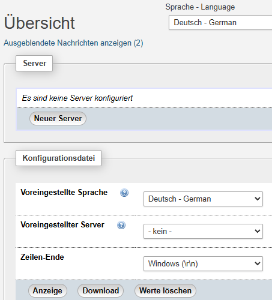
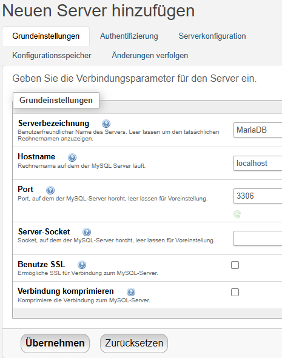
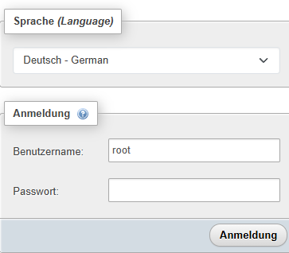
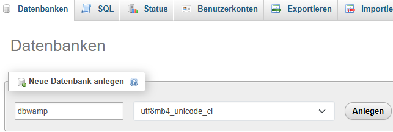
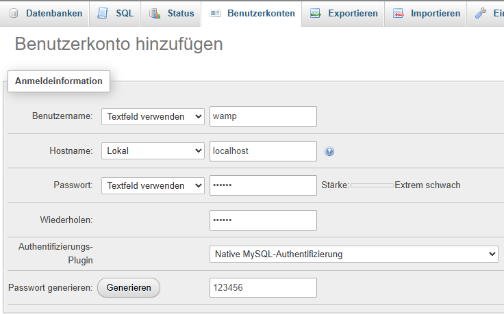
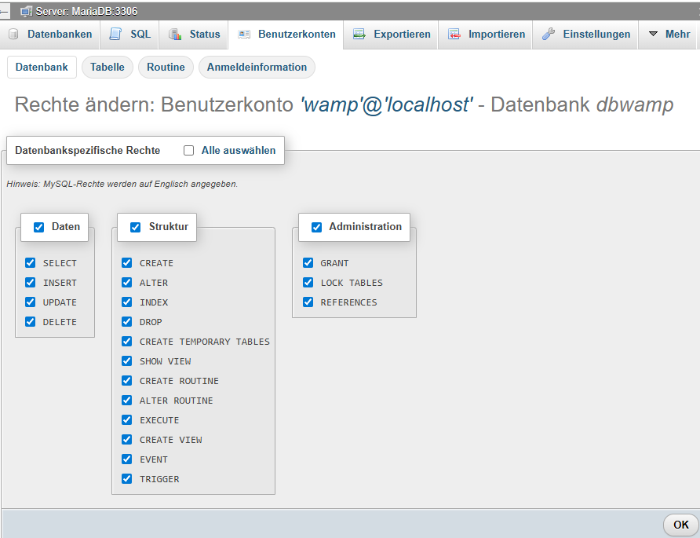

<!-- MD_BEGIN
MD_LANG:de-DE
MD_TITLE:Meine WAMP Umgebung
MD_SUBTITLE:
MD_AUTHOR:Manfred Rosenboom
MD_DATE:23-FEB-2026
MD_SUBJECT:Erzeugung meiner WAMP Testumgebung
MD_KEYWORDS:WAMP, Apache, MariaDB, PHP, Windows
MD_PUBLISHER:
MD_LICENSE:CC-BY 4.0
MD_END -->

# Meine WAMP Umgebung

|          |                                     |
|----------|-------------------------------------|
| Autor    | Manfred Rosenboom                   |
| E-Mail   | [maroph@pm.me](mailto:maroph@pm.me) |
| Web      | https://maroph.github.io/           |
| Mastodon | https://mastodon.social/@maroph     |
| Datum    | 23.02.2026, 15:06                   |

> Die Source zu diesem Dokument ist in
> [GitHub](https://github.com/maroph/technotes/tree/main/WAMP)
> hinterlegt.

---

```
__        ___    __  __ ____
\ \      / / \  |  \/  |  _ \
 \ \ /\ / / _ \ | |\/| | |_) |
  \ V  V / ___ \| |  | |  __/
   \_/\_/_/   \_\_|  |_|_|

####################################################
# Copyright (c) 2026 by Manfred Rosenboom          #
# https://maroph.github.io/ (maroph@pm.me)         #
#                                                  #
# This work is licensed under a CC-BY 4.0 License. #
# https://creativecommons.org/licenses/by/4.0/     #
####################################################
```

---

# Einleitung
Als Ablaufumgebung für meine Webentwicklung mit HTML,
CSS, JavaScript und PHP verwende ich schon seit vielen Jahren
[XAMPP](https://www.apachefriends.org/).

Die derzeit aktuelle XAMPP Version für Windows ist vom
21.11.2023 und enthält die folgenden Komponenten:

* Apache Web Server 2.4.58
* MariaDB 10.4.32
* PHP 8.2.12
* phpMyAdmin 5.2.1

Nach derzeitigem Stand ist eine aktualisierte Version eher
unwahrscheinlich. Ich habe mich deshalb entschlossen, eine
eigene Ablaufumgebung für Windows zusammenzustellen.

# Aufbau der WAMP Umgebung
> Genau wie die XAMPP Umgebung ist meine WAMP Umgebung eine
> Ablaufumgebung für die **Entwicklung**. D.h.: sowohl
> XAMPP als auch WAMP sollten **niemals** in einer
> Produktionsumgebung verwendet werden.

Für eine WAMP Umgebung auf meinem Windows 11 Rechner verwende
ich die folgenden Komponenten:

* Apache Web Server 2.4.66
* MariaDB 11.8.5
* PHP 8.4.16
* phpMyAdmin 5.2.3

Sowohl den Web Server als auch den DB Server starte ich
manuell.

Auf meinem Windows Rechner habe ich die WAMP Umgebung im
Verzeichnis 

```
C:\Tools\wamp
```

angelegt.

In diesem Verzeichnis gibt es die folgenden Verzeichnisse 
und Windows Batchdateien:

* apache  
  Apache Web Server Software.
* htdocs  
  Die Dokumentenroot des Web Servers.  
  Ruft man <http://localhost/> auf, wird der Inhalt der Datei
  _index.html_ aus diesem Verzeichnis angezeigt.
* mariadb  
  MariaDB Server Software.
* php  
  PHP Software.
* phpMyAdmin  
  phpMyAdmin Software.  
  URL: <http://localhost/phpmyadmin>
* tmp  
  Verzeichnis für temporäre Daten.
* apache_start.bat  
  Windows Batchdatei zum Starten des Web Servers.
* mariadb_start.bat  
  Windows Batchdatei zum Starten des Datenbankservers.
* mariadb_stop.bat  
  Windows Batchdatei zum Beenden des Datenbankservers.

Die Windows Batchdateien habe ich aus der XAMPP Umgebung
übernommen und für meine WAMP Umgebung angepasst. Beim
Schließen der zugehörigen Fenster werden die Server beendet.
Den MariaDB Server kann man auch mit der Windows Batchdatei
_mariadb_stop.bat_ beenden.

## MariaDB
Von der 
[MariaDB Download](https://mariadb.org/download/) 
Seite habe ich die ZIP-Datei der 
[MariaDB Server 11.8.5](https://mirror1.hs-esslingen.de/pub/Mirrors/mariadb///mariadb-11.8.5/winx64-packages/mariadb-11.8.5-winx64.zip)
Version heruntergeladen.

Diese Datei habe ich im WAMP Verzeichnis ausgepackt und von
_mariadb-11.8.5-winx64_ auf _mariadb_ umbenannt.

Danach ruft man den Installer auf:

```
> cd C:\Tools\wamp\mariadb
> bin\mariadb-install-db.exe
Default data directory is C:\Tools\wamp\mariadb\data
Running bootstrap
Creating my.ini file
Removing default user
Creation of the database was successful
```

Dabei wird das Verzeichnis _data angelegt_, in dem die
Datenbanken abgelegt werde. In diesem Verzeichnis wird 
auf die Konfigurationsdatei _my.ini_ abgelegt.

Zur generierten Datei _my.ini_ habe  ich zwei Änderungen
hinzugefügt:

1. Damit auf den Datenbank Server nur vom lokalen Rechner
aus zugegriffen werden kann, habe ich eine Bind Anweisung hinzugefügt.
2. Das Default Encoding habe ich auf UTF-8 gesetzt.
 
Datei _my.ini_:
```
[mysqld]
datadir=C:/Tools/wamp/mariadb/data
bind_address=127.0.0.1
character-set-client-handshake = FALSE
character-set-server = utf8mb4
collation-server = utf8mb4_unicode_ci

[mysql]
default-character-set = utf8mb4

[client]
plugin-dir=C:/Tools/wamp/mariadb/lib/plugin
default-character-set = utf8mb4
```

Zum Starten des Datenbankservers verwende ich die 
Windows Batchdatei _mariadb_start.bat_:

```
@echo off
cd /D %~dp0
echo Diese Eingabeforderung nicht waehrend des Running beenden
echo Please dont close Window while MySQL is running
echo MariaDB is trying to start
echo Please wait  ...
echo MariaDB is starting with mariadb\data\my.ini (console)

mariadb\bin\mariadbd.exe --console

if errorlevel 1 goto error
goto finish

:error
echo.
echo MariaDB konnte nicht gestartet werden
echo MariaDB could not be started
pause

:finish
exit
```

Den MariDB Server kann man mit der Windows Batchdatei
_mariadb_stop.bat_ beenden:

```
@echo off
cd /D %~dp0
echo MariaDB shutdown ...

mariadb\bin\mysql.exe -u root -e SHUTDOWN

if not exist mariadb\data\%computername%.pid GOTO exit
echo Delete %computername%.pid ...
del mariadb\data\%computername%.pid

pause
:exit
```

Den Zugriff auf den Datenbankserver kann man einfach
folgendermaßen testen:

```
C:\Tools\wamp\mariadb>bin\mysql -uroot
Welcome to the MariaDB monitor.  Commands end with ; or \g.
Your MariaDB connection id is 3
Server version: 11.8.5-MariaDB MariaDB Server

Copyright (c) 2000, 2018, Oracle, MariaDB Corporation Ab and others.

Type 'help;' or '\h' for help. Type '\c' to clear the current input statement.

MariaDB [(none)]> exit
Bye
```

## Apache Web Server
Von der
[Apache Lounge Download](https://www.apachelounge.com/download/)
Seite habe ich mir die Zip-Datei
[Apache 2.4.66-260107 Win64](https://www.apachelounge.com/download/VS18/binaries/httpd-2.4.66-260107-Win64-VS18.zip)
heruntergeladen.

Den Inhalt der ZIP-Datei habe ich im WAMP-Verzeichnis 
ausgepackt und das Verzeichnis _Apache24_ in _apache_ 
umbenannt.

Die im WAMP-Verzeichnis abgelegte Datei _ReadMe.txt_ habe
ich in _Apache_Windows_ReadMe.txt_ umbenannt und in das
Verzeichnis _apache_ verschoben.

In der Datei _apache/conf/httpd.conf_ habe ich den Pfad der
Server Konfiguration an meine WAMP Umgebung angepasst:

```
ServerRoot "C:/Tools/wamp/apache"
```

In der Listen Anweisung habe ich den Zugriff auf den lokalen
Rechner eingeschränkt:

```
Listen 127.0.0.1:80
```

Die Anweisung ScriptAlias habe ich ebenfalls angepasst:

```
ScriptAlias /cgi-bin/ "C:/Tools/wamp/apache/cgi-bin/"
```

Zusätzlich muss die Anweisung
```
<Directory "C:/Apache24/cgi-bin">
```

durch

```
<Directory "C:/Tools/wamp/apache/cgi-bin">
```

ersetzt werden.

Die Dokumentenroot

```
DocumentRoot "C:/Apache24/htdocs"
<Directory "C:/Apache24/htdocs">
```

habe ich folgendermaßen angepasst:

```
DocumentRoot "C:/Tools/wamp/htdocs"
<Directory "C:/Tools/wamp/htdocs">
```

Der Apache Web Server wird gestartet mit der Windows Batchdatei
_apache_start.bat_:

```
@echo off
setlocal
echo %~dp0

PATH=C:\Tools\wamp\php;%PATH%

cd /D %~dp0
echo Diese Eingabeforderung nicht waehrend des Running beenden
echo Bitte erst bei einem gewollten Shutdown schliessen
echo Please close this command only for Shutdown
echo Apache 2 is starting ...

apache\bin\httpd.exe

if errorlevel 255 goto finish
if errorlevel 1 goto error
goto finish

:error
echo.
echo Apache konnte nicht gestartet werden
echo Apache could not be started
pause

:finish
endlocal
exit
```

### HTTPS (SSL)
Will man lokal auch mit HTTPS Verbindungen testen, kann man
zusätzlich das Apache SSL Modul aktivieren. 

In der Datei

```
C:\Tools\wamp\apache\conf\httpd.conf
```

muss man dazu die folgenden Zeilen entkommentieren:

```
LoadModule ssl_module modules/mod_ssl.so
LoadModule socache_shmcb_module modules/mod_socache_shmcb.so
```

Am Ende der Datei sind die beiden folgenden Zeilen hinzuzufügen,
damit die SSL Konfiguration geladen wird:

```
# Secure (SSL/TLS) connections
Include conf/extra/httpd-ssl.conf
```

In der Datei

```
C:\Tools\wamp\apache\conf\extra\httpd-ssl.conf
```

habe ich in der Listen Anweisung den Zugriff auf den lokalen
Rechner eingeschränkt:

```
Listen 127.0.0.1:443
```


sind die folgenden Anpassungen notwendig:

```
<VirtualHost _default_:443>

#   General setup for the virtual host
# DocumentRoot "C:/Apache24/htdocs"
DocumentRoot "C:/Tools/wamp/htdocs"
# ServerName www.example.com:443
# ServerAdmin you@example.com
# ErrorLog "/error_log"
ErrorLog "C:/Tools/wamp/apache/logs/error_log"
# TransferLog "/access_log"
TransferLog "C:/Tools/wamp/apache/logs/access_log"

SSLCertificateFile "C:/Tools/wamp/apache/conf/wamp_unsigned.pem"
SSLCertificateKeyFile "C:/Tools/wamp/apache/conf/wamp_noenc.key"

CustomLog "C:/Tools/wamp/apache/logs/ssl_request_log" \
          "%t %h %{SSL_PROTOCOL}x %{SSL_CIPHER}x \"%r\" %b"
```

* wamp_unsigned.pem  
  Web Server Zertifikat
  Mit meiner Zertifikatsdatei kann der Web Server unter 3
  Namen angesprochen werden:
    * wamp (<https://wamp>)
    * localhost (<https://localhost>)
    * 127.0.0.1 (<https://127.0.0.1>)
* wamp_noenc.key  
  Web Server Private Key.

#### Erzeugen eines Self-Signed Serverzertifikat
Die obigen Dateien habe ich auf einem Debian 13.3 System mit 
OpenSSL 3.5.4 folgendermaßen erstellt.

Die RSA Bitlänge von 2048 Bits gilt derzeit noch als sicher. Für
einen Produktivsystem würde ich deshalb eine Bitlänge von 
3072 Bits oder 4096 Bits verwenden. Alternativ kann man auch
einen ECC Algorithmus verwenden.

```
$ openssl genpkey -algorithm RSA -pkeyopt rsa_keygen_bits:2048 \
  -aes-256-cbc -pass pass:changeit -out wamp.key
$ chmod 600 wamp.key

$ openssl pkey -in wamp.key -out wamp_noenc.key \
  -passin pass:changeit
$ chmod 600 wamp_noenc.key

$ openssl req -new -utf8 -x509 -extensions v3_ca \
  -key wamp_noenc.key -out wamp_unsigned.pem \
  --sha256 -days 3653 \
  -addext subjectAltName=DNS:localhost,IP:127.0.0.1 \
  -subj '/C=DE/ST=Bavaria/L=Munich/O=maroph/OU=WAMP/CN=wamp'
$ chmod 644 wamp_unsigned.pem
```

```
$ openssl x509 -text -noout -in wamp_unsigned.pem
Certificate:
    Data:
        Version: 3 (0x2)
        Serial Number:
            5e:5f:d3:7b:a7:e4:b6:04:5f:22:8a:18:f6:df:bb:0f:6e:cf:76:77
        Signature Algorithm: sha256WithRSAEncryption
        Issuer: C=DE, ST=Bavaria, L=Munich, O=maroph, OU=WAMP, CN=wamp
        Validity
            Not Before: Jan 19 16:55:46 2026 GMT
            Not After : Jan 20 16:55:46 2036 GMT
        Subject: C=DE, ST=Bavaria, L=Munich, O=maroph, OU=WAMP, CN=wamp
        Subject Public Key Info:
            Public Key Algorithm: rsaEncryption
                Public-Key: (2048 bit)
                Modulus:
                    00:af:9b:02:65:51:5a:14:0a:66:91:83:04:14:c3:
                    7e:ea:73:3d:6e:41:f4:ad:60:ab:3a:b3:bc:f6:4a:
                    87:66:fd:7a:e5:6a:17:f3:7b:ed:32:e3:3c:9d:f8:
                    68:12:59:73:30:3c:35:88:e4:96:0e:9b:65:00:75:
                    dc:85:33:92:b6:32:56:22:6e:3c:2b:cb:3f:0a:25:
                    42:99:9a:35:ff:81:fb:18:d6:b0:21:d2:69:da:ab:
                    54:cb:ea:48:91:3b:e3:cf:e4:5d:ea:cc:62:da:2a:
                    25:27:bd:da:38:91:9b:3b:5c:b6:b2:39:63:5f:c7:
                    47:f8:38:7f:83:4e:dd:42:5d:96:e0:4b:b8:57:ea:
                    1d:4a:39:39:08:f1:be:d7:bf:d7:a2:69:28:f1:3b:
                    45:67:d1:8e:cf:8c:5e:00:58:af:1e:54:4a:8c:8c:
                    fa:c6:93:9f:de:4a:1a:1d:78:34:69:b0:36:33:2c:
                    b9:1d:eb:1c:da:50:f7:01:a3:3d:bf:fa:e5:6b:ba:
                    f9:a3:17:de:e6:1e:ca:96:d6:65:86:3e:cd:bb:d8:
                    d5:42:58:11:ad:10:f4:a4:03:d5:b7:28:1a:83:e8:
                    95:5b:db:f6:49:a0:f1:23:08:49:19:63:f1:97:e1:
                    8c:ca:d3:64:13:4a:eb:e8:c8:e6:a5:ef:47:bb:fe:
                    e6:ed
                Exponent: 65537 (0x10001)
        X509v3 extensions:
            X509v3 Subject Key Identifier:
                24:55:20:BF:9A:11:92:49:15:7F:90:1E:75:77:7D:19:6A:EB:46:CC
            X509v3 Authority Key Identifier:
                24:55:20:BF:9A:11:92:49:15:7F:90:1E:75:77:7D:19:6A:EB:46:CC
            X509v3 Basic Constraints: critical
                CA:TRUE
            X509v3 Subject Alternative Name:
                DNS:localhost, IP Address:127.0.0.1
    Signature Algorithm: sha256WithRSAEncryption
    Signature Value:
        52:c3:21:4e:eb:f0:1c:86:b9:17:66:e8:54:1b:29:85:98:37:
        f8:55:ca:c4:39:96:d1:49:e3:21:e7:1e:41:14:40:2b:ae:ec:
        15:67:a4:b2:ea:89:c3:0c:6a:b0:a1:0e:df:60:cf:62:8b:4c:
        e1:a4:70:f5:6d:54:29:e1:83:ff:de:e6:d8:a5:79:39:b2:72:
        01:79:e8:77:c3:8e:69:30:b7:d3:00:f4:6b:f1:1a:c9:a7:89:
        6d:27:08:ee:bf:99:c0:77:86:d0:8e:47:8b:ef:bd:fb:98:99:
        32:9a:58:07:d8:0c:b9:b1:11:ce:f8:ce:0d:5b:a2:2d:2b:5c:
        40:7f:03:cc:cb:11:a1:99:f1:ce:2c:f3:ae:61:0e:dc:11:d5:
        e7:ee:9a:5c:1e:cc:1d:dd:dd:35:bd:c9:d0:30:bf:19:85:36:
        1d:f3:a4:51:d3:7f:aa:ec:ce:c2:39:9f:8a:04:bf:f3:14:e8:
        84:0c:26:0d:01:ea:f4:c5:7e:d5:80:b8:82:10:d3:83:b6:e0:
        25:8e:0a:78:93:d5:f5:c8:a9:15:b6:32:97:44:9a:b2:52:6d:
        d1:39:44:82:a0:cf:82:65:46:0f:6f:4d:2d:27:35:ce:b9:4e:
        21:53:5e:4c:2a:b4:69:20:b1:2a:eb:3f:06:4a:f3:d1:2f:3b:
        b3:ba:b5:c1
```

In der WAMP Umgebung kann man OpenSSL 3.6.0.1 verwenden 
(_apache\bin\openssl.exe_).

## PHP
Von der
[Windows PHP Download](https://windows.php.net/download/)
Seite habe ich die PHP 8.4.16 Version
[VS17 x64 Thread Safe (2025-Dec-17 14:54:13)](https://windows.php.net/downloads/releases/php-8.4.16-Win32-vs17-x64.zip)
heruntergeladen.

Alternativ kann man auch die PHP 8.5.1 Version 
[VS17 x64 Thread Safe (2025-Dec-17 17:15:55)](https://windows.php.net/downloads/releases/php-8.5.1-Win32-vs17-x64.zip)
verwenden. Da auf meinem Debian 13 System PHP 8.4 installiert
ist, verwende ich für meine Testumgebung ebenfalls eine 
PHP 8.4 Version.

Im WAMP-Verzeichnis habe ich das Verzeichnis _php_ angelegt
und die ZIP-Datei in dieses Verzeichnis ausgepackt.

Zusätzlich habe ich im WAMP-Verzeichnis das Verzeichnis 
_tmp_ angelegt.

Im Verzeichnis _php_ habe ich die Datei _php.ini-development_
auf den Namen _php.ini_ kopiert.

In der Datei _php.ini_ habe ich die folgenden Zeilen angepasst:

```
error_log="C:\Tools\wamp\php\logs\php_error_log"
extension_dir = "C:\Tools\wamp\php\ext"
upload_tmp_dir = "C:\Tools\wamp\tmp"
session.save_path = "C:\Tools\wamp\tmp"
curl.cainfo = "C:\Tools\wamp\apache\bin\curl-ca-bundle.crt"
openssl.cafile = "C:\Tools\wamp\apache\bin\curl-ca-bundle.crt"
```

und die folgenden Extensions aktiviert:

```
extension=bz2
extension=curl
extension=gd
extension=mbstring
extension=mysqli
extension=openssl
extension=pdo_mysql
extension=pdo_sqlite
extension=sqlite3
extension=zip
```

Am Ende der Datei _apache/conf/httpd.conf_ habe ich die
folgenden Zeilen hinzugefügt:

```
# PHP8 module
PHPIniDir "C:/Tools/wamp/php"
LoadModule php_module "C:/Tools/wamp/php/php8apache2_4.dll"
AddType application/x-httpd-php .php
```

```
C:\Tools\wamp>apache\bin\httpd.exe -t
Syntax OK
```

## phpMyAdmin
Von der
[phpMyAdmin Downloads](https://www.phpmyadmin.net/downloads/)
Seite habe ich die ZIP-Datei
[phpMyAdmin-5.2.3-all-languages.zip](https://files.phpmyadmin.net/phpMyAdmin/5.2.3/phpMyAdmin-5.2.3-all-languages.zip)
und im WAMP-Verzeichnis ausgepackt.

Das dabei entstandene Verzeichnis 
_phpMyAdmin-5.2.3-all-languages_ habe ich in 
_phpMyAdmin_ umbenannt.

In der Datei _apache/conf/httpd.conf_ habe ich nach der Zeile

```
ScriptAlias /cgi-bin/ "C:/Tools/wamp/apache/cgi-bin/"
```

die Zeile

```
Alias /phpmyadmin C:/Tools/wamp/phpMyAdmin
```

hinzugefügt.

Am Ende der Datei _apache/conf/httpd.conf_ habe ich die
folgenden Zeilen hinzugefügt:

```
# phpMyAdmin Apache configuration
<Directory C:/Tools/wamp/phpMyAdmin>
    # Options SymLinksIfOwnerMatch
    DirectoryIndex index.php
    Options Indexes FollowSymLinks
    AllowOverride None
    Require all granted
</Directory>

# Disallow web access to directories that don't need it
<Directory C:/Tools/wamp/phpMyAdmin/templates>
    Require all denied
</Directory>
<Directory C:/Tools/wamp/phpMyAdmin/libraries>
    Require all denied
</Directory>
<Directory C:/Tools/wamp/phpMyAdmin/setup/lib>
    Require all denied
</Directory>
```

```
C:\Tools\wamp>apache\bin\httpd.exe -t
Syntax OK
```

Die benötigte Konfigurationsdatei _config.inc.php_ erzeugt man
durch das Ausführen des Setup-Assistenten unter
<http://localhost/phpmyadmin/setup>.



Auf dieser Seite wählt man "Neuer Server" aus.




Klickt man auf "Download", kann man die Datei 
_config.inc.php_ in das Verzeichnis _phpMyAdmin_ herunterladen.

In dieser Datei muss man nach der Zeile
```
$cfg['Servers'][$i]['password'] = '';
```

noch die folgende Zeile hinzufügen:
```
$cfg['Servers'][$i]['AllowNoPassword'] = true;
```

Jetzt kann man sich auf der Seite

<http://localhost/phpmyadmin/>

mit dem Benutzer _root_ und einem leeren Passwort (_""_)
anmelden.



### Testdatenbank anlegen

|               |        |
|---------------|--------|
| Datenbankname | dbwamp |
| Benutzer      | wamp   |
| Passwort      | 123456 |

Mit Hilfe von _phpMyAdmin_ kann man auf einfache Weise eine
Datenbank anlegen.

Datenbank anlegen


Benutzer anlegen


Benutzerrechte setzen


### Verbindung zur Testdatenbank aufbauen

```
C:\Tools\wamp>mariadb\bin\mysql.exe --user=wamp --password=123456 dbwamp
Welcome to the MariaDB monitor.  Commands end with ; or \g.
Your MariaDB connection id is 91
Server version: 11.8.5-MariaDB MariaDB Server

Copyright (c) 2000, 2018, Oracle, MariaDB Corporation Ab and others.

Type 'help;' or '\h' for help. Type '\c' to clear the current input statement.

MariaDB [dbwamp]> exit
Bye
```

```
$conn = new mysqli('localhost', 'wamp', '123456', 'dbwamp');
```
